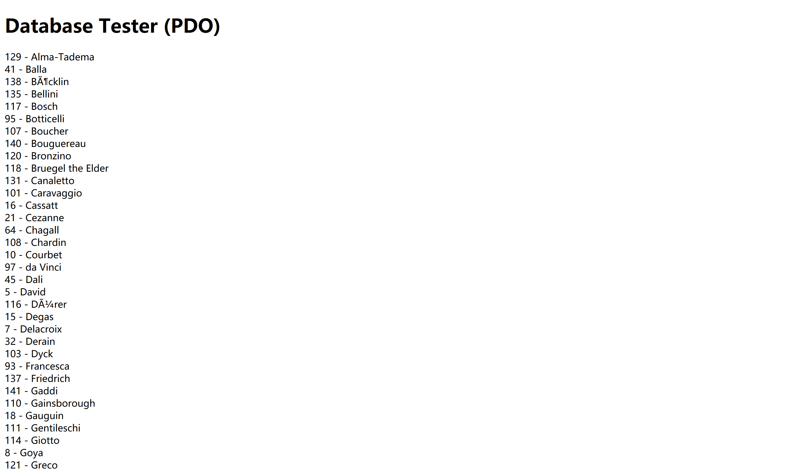
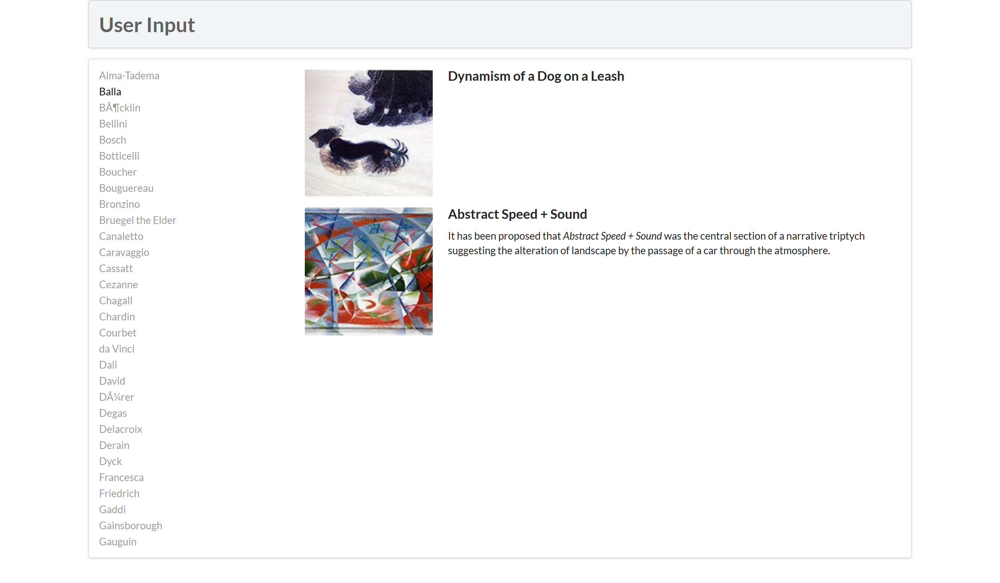

# lab10 Document

学号：19300200019

姓名：刘乔升

## Exercise 7

```html
   <?php require_once('config.php'); ?>
   <!DOCTYPE html>
   <html>
   <body>
   <h1>Database Tester (PDO)</h1> <?php
   try {
     // connect to database via PDO
     $pdo = new PDO(DBCONNSTRING,DBUSER,DBPASS);

     // set errmode to 'throw exceptions'
     $pdo->setAttribute(PDO::ATTR_ERRMODE, PDO::ERRMODE_EXCEPTION);  

     // send query $sql to database, accept result and store in $result
     $sql = "select * from Artists order by LastName";
     $result = $pdo->query($sql);

     // read the result by row and write in flow
     while ($row = $result->fetch()) {
         echo $row['ArtistID'] . " - " . $row['LastName'] . "<br/>"; 
     }

     // close connection
     $pdo = null; 

     // catch any exception and throw
   }catch (PDOException $e) { 
       die( $e->getMessage() );
   }
   ?>  
   </body>  
   </html>
   ```


```html
   <?php require_once('config.php'); ?>
   <!DOCTYPE html>
   <html>
   <body>
   <h1>Database Tester (mysqli)</h1> Genre:
   <select>
   <?php  
   // connect to database via mysqli
   $connection = mysqli_connect(DBHOST, DBUSER, DBPASS, DBNAME); 

    // exit if any error occurs
   if ( mysqli_connect_errno() ) {
      die( mysqli_connect_error() ); 
   }

   $sql = "select * from Genres order by GenreName"; 
   if ($result = mysqli_query($connection, $sql)) {
     // loop through the data
     while($row = mysqli_fetch_assoc($result)) {
        echo '<option value="' . $row['GenreID'] . '">'; 
        echo $row['GenreName'];
        echo "</option>";
     }
     // release the memory used by the result set
     mysqli_free_result($result); 
   }
   // close the database connection
   mysqli_close($connection);
   ?>
   </select>
   </body>
   </html>
   ```


## Exercise 8



```php
/*
 Displays the list of artist links on the left-side of page
*/
function outputArtists() {
   try {
       // connect and initial
         $pdo = new PDO(DBCONNSTRING,DBUSER,DBPASS);
         $pdo->setAttribute(PDO::ATTR_ERRMODE, PDO::ERRMODE_EXCEPTION);
         
         // get 30 rows from Artists
         $sql = "select * from Artists order by LastName limit 0,30";
         $result = $pdo->query($sql);
         while ($row = $result->fetch()) {

             // generate elements and set active element
            echo '<a href="' . $_SERVER["SCRIPT_NAME"] . '?id=' . $row['ArtistID'] . '" class="';
            if (isset($_GET['id']) && $_GET['id'] == $row['ArtistID']) echo 'active ';
            echo 'item">';
            echo $row['LastName'] . '</a>';
         }

         // close connection
         $pdo = null;
   }
   catch (PDOException $e) {
      die( $e->getMessage() );
   }
}

/*
 Displays the list of paintings for the artist id specified in the id query string
*/
function outputPaintings() {
   try {

       // if current query string has id
     if (isset($_GET['id']) && $_GET['id'] > 0) {
       $pdo = new PDO(DBCONNSTRING,DBUSER,DBPASS); 
       $pdo->setAttribute(PDO::ATTR_ERRMODE, PDO::ERRMODE_EXCEPTION);
       
       // get all rows of this artist and display
       $sql = 'select * from Paintings where ArtistId=' . $_GET['id']; 
       $result = $pdo->query($sql);
       while ($row = $result->fetch()) {
          outputSinglePainting($row); 
       }

        //close connection
       $pdo = null; 
     }
   }catch (PDOException $e) {
      die( $e->getMessage() ); 
   }
}


/*
 Displays a single painting
*/

// generate elements containing image
function outputSinglePainting($row) {
   echo '<div class="item">';
   echo '<div class="image">';
   echo ''; 
   echo '</div>';
   echo '<div class="content">';
   echo '<h4 class="header">'; 
   echo $row['Title'];
   echo '</h4>';
   echo '<p class="description">';
   echo $row['Excerpt'];
   echo '</p>';
   echo '</div>'; // end class=content 
   echo '</div>'; // end class=item
}
```

## Exercise 9


1. 
```php
mixed mysqli::query(string query, int resultmode = MYSQLI_STORE_RESULT);
mixed mysqli_query(mysqli link, string query, int resultmode = MYSQLI_STORE_RESULT);
```
Returns FALSE on failure. For successful SELECT, SHOW, DESCRIBE or EXPLAIN queries ``mysqli_query`` will return a ``mysqli_result`` object. For other successful queries ``mysqli_query`` will return TRUE.

2. 
```php
bool mysqli::real_query(string query);
bool mysqli_real_query(mysqli link, string query);
```
Result can then be retrieved or stored using the ``mysqli_store_result`` or ``mysqli_use_result`` functions.

3. 
```php
bool mysqli::multi_query(string query);
bool mysqli_multi_query(mysqli link, string query);
```
Executes one or multiple queries which are concatenated by a semicolon.

Using ``mysqli_use_result`` or ``mysqli_store_result`` to retrieve the result set from the first query. All subsequent query results can be processed using ``mysqli_more_results`` and ``mysqli_next_result``.

4. 
```php
mysqli_stmt mysqli::prepare(string query);
mysqli_stmt mysqli_prepare(mysqli link, string query);

bool mysqli_stmt::execute();
bool mysqli_stmt_execute(mysqli_stmt stmt);

bool mysqli_stmt::bind_param(string types,
                             mixed var1,
                             mixed ...);
bool mysqli_stmt_bind_param(mysqli_stmt stmt,
                            string types,
                            mixed var1,
                            mixed ...);
```
Prepares the SQL query, and returns a statement handle to be used for further operations on the statement. The query must consist of a single SQL statement.

The parameter markers must be bound to application variables using ``mysqli_stmt_bind_param`` and/or ``mysqli_stmt_bind_result`` before executing the statement or fetching rows.

**The advantage of using Prepared Statements** is that a mysql statement can bind different param and be reused easily.