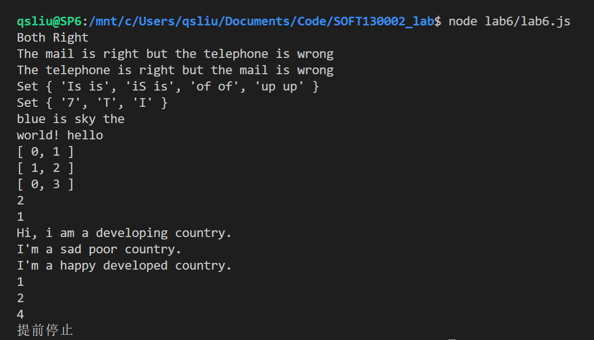
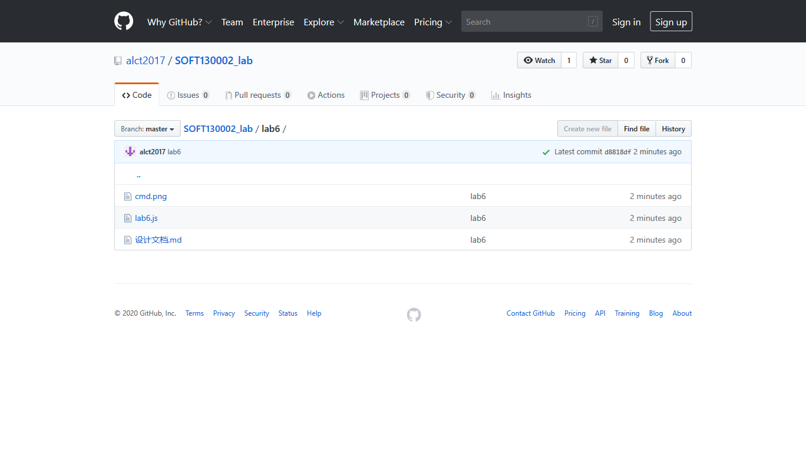

# lab6设计文档

## 正则表达式

2.电话号码`/[0-9]{11}/`：11位数字

邮箱`/^[a-zA-z0-9]+([\.\-\_]?[a-zA-Z0-9]+)*@[a-zA-Z0-9]+([\-\.]?[a-zA-Z0-9]+)*(\.[a-z]{2,})+$/`:`^`和`$`限定了整个字符串都要符合，而不仅是其中的一个字串。`[a-zA-Z0-9]+`以数字或字母开头。`([\.\-\_]?[a-zA-Z0-9]+)*`前缀可以包含不连续的下划线`_`，点`.`，或者横杠`-`。后缀也是类似。最后`(\.[a-z]{2,})+`可以包含多个域名，域名是`.`加2个以上字母。

3.重复单词`/\b(\w+)\s+\1\b/i`：前后单词分割符`\b`保证这两个都是完整单词，而不是一个单词的后缀和另一个单词的前缀。`(\w+)`匹配一个单词，后面的`\1`匹配同一个单词。中间的`\s+`匹配中间的多个空格。最后的`i`模式忽略大小写。

## 继承

### 构造函数

在构造函数里调用父类的`call`方法。

### 原型链

把父类的一个实例赋给子类的`prototype`。

### `Object.create`

`Object.create`父类的原型并赋给子类的原型。再把子类的原型的`constructor`重设成子类本身。

## `Map`,`Set`,`Array`

`Map`有序地储存键值对，可以当作哈希表使用。可以增删改查键值对，可以用键来访问值。可以用迭代器迭代。

`Set`储存无序的对象。相同的对象只会被储存一次。可以用来去重。

`Array`有序地存储对象。可以用下标访问。相当于一个可以扩容的数组。